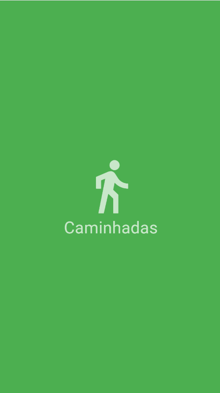
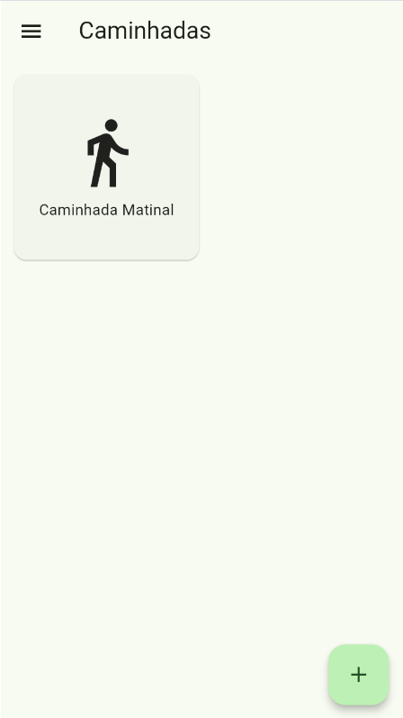
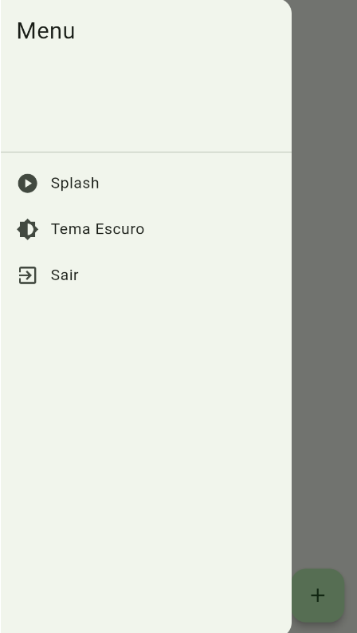
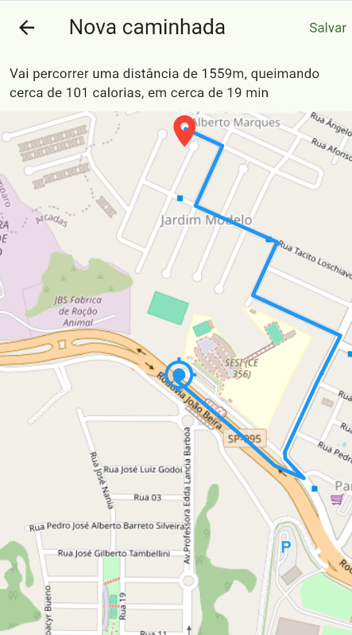
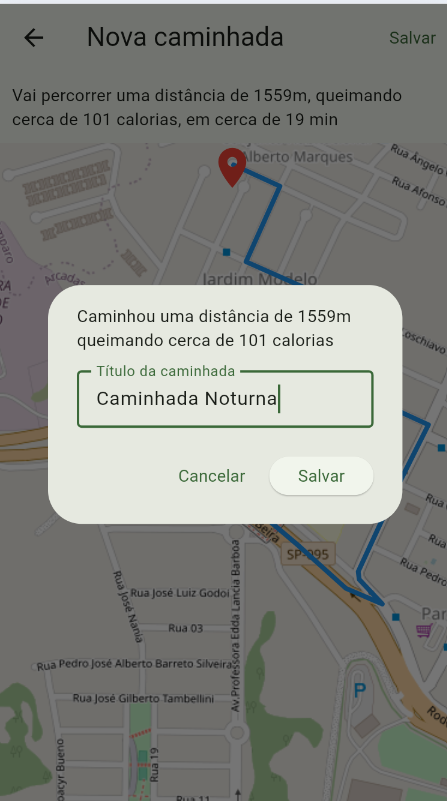
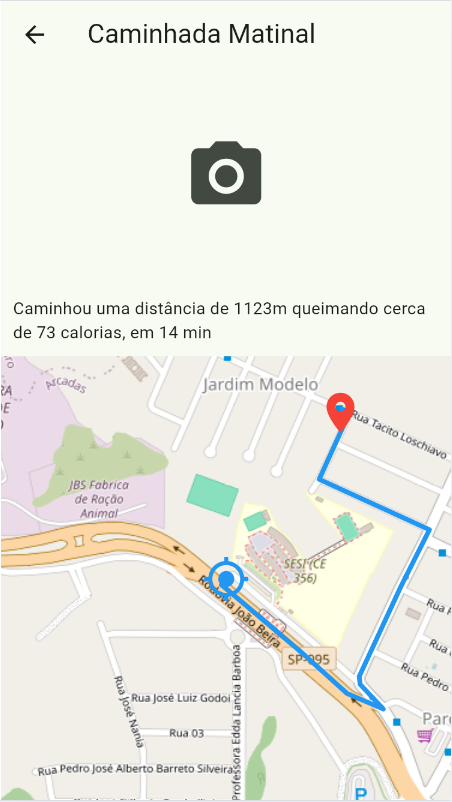

# App Caminhadas 🚶‍♂️‍➡️

Aplicativo mobile feito em Flutter para registrar e acompanhar caminhadas. O usuário escolhe um destino no mapa, o app traça o trajeto, calcula a distância, o gasto calórico e o tempo estimado, e salva tudo no celular.

Projeto desenvolvido como desafio da aula de Programação para Dispositivos Móveis (SENAI).

## Funcionalidades 📄

- **Splash:** tela inicial com animação de entrada e saída
- **Home:** lista de caminhadas salvas, menu lateral (Splash, tema claro/escuro e Sair) e botão **+** para nova caminhada
- **Nova caminhada:** mapa para escolher o destino, trajeto, distância, calorias e tempo estimado, e botão **Salvar** que abre um modal pedindo o título
- **Detalhes:** mapa com o trajeto, distância, calorias, tempo, título e foto. Se ainda não tiver foto, aparece o ícone da câmera para tirar uma

## Tecnologias utilizadas 👩🏻‍💻

- Flutter / Dart
- flutter_map e latlong2 (mapa do OpenStreetMap)
- geolocator (localização do usuário)
- image_picker (câmera)
- shared_preferences (armazenamento local)
- http (busca do trajeto a pé)

## Como executar ❓

1. Instale o [Flutter](https://docs.flutter.dev/get-started/install)
2. Clone este repositório:
   ```
   git clone LINK_DO_SEU_REPOSITORIO
   cd caminhadas
   ```
3. Instale as dependências:
   ```
   flutter pub get
   ```
4. Rode o app em um emulador ou celular conectado:
   ```
   flutter run
   ```

## Prints das telas 📸

| Splash | Home | Menu |
|:---:|:---:|:---:|
|  |  |  |

| Nova caminhada | Salvar | Detalhes |
|:---:|:---:|:---:|
|  |  |  |

## Download do APK ⬇️

[Clique aqui para baixar o app-release.apk](./build/app/outputs/flutter-apk/app-release.apk)

## Autora 🩷

Isabelle Borges
